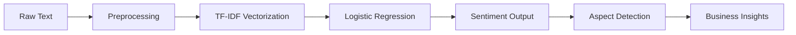

<h1 align="center">🚀 BrandLensAI</h1>
<h3 align="center">NLP-Powered Brand Sentiment & Engagement Intelligence</h3>

<p align="center">
  
  
  
  
</p>

---

## ✨ Overview

💡 **BrandLensAI** is a real-time NLP system that analyzes social media text to extract:

* 🔍 Sentiment (Positive / Negative)
* 🎯 Key Aspect (Delivery, Pricing, Product, etc.)
* 📊 Confidence Score
* ⚡ Engagement Intelligence
* 📈 Business Insights

👉 Designed to simulate how companies monitor brand perception at scale.

---

## 🌐 Live App

👉 **[Click here to try the app](https://brandlensai-kditvaje3ka3cr2krfnho2.streamlit.app/)**

---

## 🧠 ML Pipeline



---

## 📊 Model Performance

| Metric   | Value                      |
| -------- | -------------------------- |
| Accuracy | **77.31%**                 |
| Model    | Logistic Regression        |
| Dataset  | Sentiment140 (1.6M tweets) |
| Features | TF-IDF                     |

---

## 🧩 Key Features

✨ Real-time sentiment prediction
🧠 Aspect-based classification
⚡ Rule-based correction layer
📊 Interactive dashboard (Streamlit)
📈 Engagement-based insights

---

## 🛠️ Tech Stack

### 📊 Data & Visualization


### 🤖 Machine Learning


### 🌐 App


---

## 📁 Project Structure

```bash
BrandLensAI/
│
├── app.py
├── preprocessing.py
├── sentiment_model.pkl
├── tfidf_vectorizer.pkl
├── requirements.txt
│
├── notebooks/
│   └── model_training.ipynb
│
└── README.md
```

---

## 🚀 Run Locally

```bash
git clone https://github.com/YOUR_USERNAME/BrandLensAI.git
cd BrandLensAI
pip install -r requirements.txt
streamlit run app.py
```

---

## 💼 Business Use Cases

* 📣 Brand reputation monitoring
* 🛍️ E-commerce feedback analysis
* 📊 Customer sentiment tracking
* 🚨 Early detection of negative trends

---

## 🔮 Future Improvements

* 🔗 Real-time API integration (Twitter/Reddit)
* 🤖 Deep learning models (BERT)
* 📊 Advanced analytics dashboard
* 🌍 Multi-language support

---

## 👩‍💻 Author

**Priya Santosh Sharma**

---

## ⭐ Support

If you found this useful, give it a ⭐ on GitHub!

---

<p align="center">
✨ Built with passion for data & AI ✨
</p>

